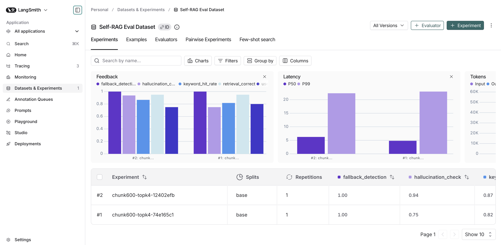
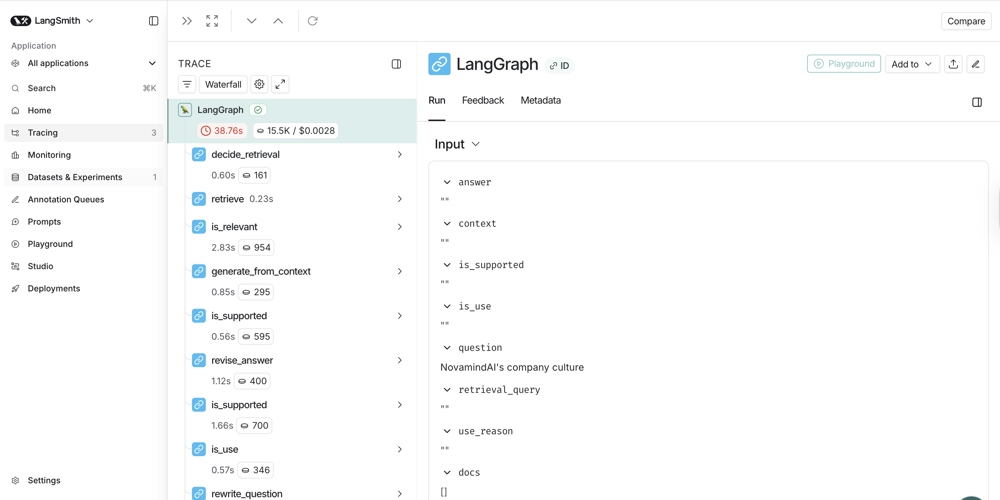

# Self-RAG: Self-Reflective Retrieval-Augmented Generation

> A production-ready RAG pipeline that **checks its own answers** for hallucinations, relevance, and usefulness before responding — built with LangGraph, LangChain, and FAISS.


---

## Why Self-RAG?

Standard RAG retrieves documents and generates an answer. **Self-RAG adds reflection loops** — the system evaluates its own output at every step:

| Step | What it checks | What happens on failure |
|------|---------------|----------------------|
| **Decide Retrieval** | Does this question need document search? | Routes to direct LLM answer |
| **Is Relevant** | Are the retrieved docs actually relevant? | Returns "No relevant document found" |
| **Is Supported** | Is the answer grounded in the documents? | Revises the answer (up to 5 retries) |
| **Is Useful** | Does the answer actually address the question? | Rewrites the query and re-retrieves (up to 3 times) |

This makes the system **significantly more trustworthy** than a standard RAG pipeline — it admits when it doesn't know, catches hallucinations, and iterates until the answer is useful.

---

## Architecture

```
                         ┌──────────────────┐
                         │   User Question  │
                         └────────┬─────────┘
                                  │
                         ┌────────▼─────────┐
                         │ Decide Retrieval  │
                         └────────┬─────────┘
                           ┌──────┴──────┐
                     need=false      need=true
                           │             │
                  ┌────────▼───┐  ┌──────▼──────┐
                  │  Direct    │  │  Retrieve    │
                  │  Answer    │  │  (FAISS)     │
                  └────────┬───┘  └──────┬──────┘
                           │             │
                          END    ┌───────▼───────┐
                                │  Is Relevant?  │──── no ──→ "No relevant doc found" → END
                                └───────┬───────┘
                                       yes
                                        │
                                ┌───────▼───────┐
                                │   Generate    │
                                │   Answer      │
                                └───────┬───────┘
                                        │
                                ┌───────▼───────┐
                          ┌─────│ Is Supported? │◄──── revise (max 5x)
                          │     └───────────────┘
                         yes
                          │
                  ┌───────▼───────┐
                  │  Is Useful?   │──── no ──→ Rewrite Query → Re-retrieve (max 3x)
                  └───────┬───────┘
                         yes
                          │
                         END ✅
```

---

## Tech Stack

| Component | Technology |
|-----------|-----------|
| **Orchestration** | LangGraph (state machine with conditional edges) |
| **LLM** | OpenAI `gpt-4o-mini` (temperature=0) |
| **Embeddings** | OpenAI `text-embedding-3-large` |
| **Vector Store** | FAISS (persistent index on disk) |
| **Structured Output** | Pydantic models with LangChain `with_structured_output` |
| **API** | FastAPI with lifespan-managed graph |
| **Evaluation** | LangSmith Datasets + Experiments with custom evaluators |
| **Document Loading** | PyPDFLoader (3 company PDFs) |

---

## Project Structure

```
self-rag/
├── app/
│   ├── config.py          # Centralized config, singleton LLM/embeddings
│   ├── models.py          # State TypedDict + Pydantic schemas
│   ├── prompts.py         # All 8 prompt templates
│   ├── vectorstore.py     # FAISS build/load/retrieve with persistence
│   ├── nodes.py           # 11 graph nodes + 4 routing functions
│   ├── graph.py           # StateGraph construction and compilation
│   └── api.py             # FastAPI endpoints (POST /ask, GET /health)
├── evals/
│   ├── dataset.json       # 20-question golden dataset (7 categories)
│   ├── langsmith_evals.py # LangSmith experiment runner + 5 custom evaluators
│   └── run_evals.py       # Local CLI eval runner
├── scripts/
│   └── rebuild_index.py   # CLI to rebuild FAISS index from PDFs
├── data/
│   └── pdfs/              # Source documents (policies, profile, pricing)
├── RAG.ipynb              # Original notebook (exploration + prototyping)
└── requirements.txt
```

---

## Quick Start

### 1. Install dependencies
```bash
python3.11 -m venv .venv
source .venv/bin/activate
pip install -r requirements.txt
```

### 2. Set environment variables
```bash
# Create .env file
echo "OPENAI_API_KEY=sk-..." > .env

# Optional: Enable LangSmith tracing
echo "LANGCHAIN_TRACING_V2=true" >> .env
echo "LANGCHAIN_API_KEY=lsv2-..." >> .env
echo "LANGCHAIN_PROJECT=Self_RAG" >> .env
```

### 3. Build vector index
```bash
python3.11 -m scripts.rebuild_index
```

### 4. Start the API
```bash
python3.11 -m uvicorn app.api:api --reload
```

### 5. Query the API
```bash
curl -X POST http://localhost:8000/ask \
  -H "Content-Type: application/json" \
  -d '{"question": "Who is the CEO of NovaMind AI?"}'
```

---

## Evaluation

### Golden Dataset

20 questions across 7 categories designed to test every failure mode:

| Category | Count | Tests |
|----------|-------|-------|
| Factual Lookup | 3 | Can it find a single fact? |
| Pricing | 4 | Can it extract numbers accurately? |
| Policy Detail | 2 | Can it find specific policy rules? |
| Comparison | 2 | Can it compare items side-by-side? |
| Cross-Document | 3 | Can it synthesize across multiple PDFs? |
| No Retrieval Needed | 3 | Does it skip search for general knowledge? |
| Negative Tests | 3 | Does it say "I don't know" when it should? |

### Custom Evaluators

| Metric | What it measures |
|--------|-----------------|
| **Keyword Hit Rate** | Fraction of expected facts present in the answer |
| **Retrieval Correctness** | Did it search when it should have (and vice versa)? |
| **Hallucination Check** | Is the answer grounded in retrieved documents? |
| **Usefulness Check** | Does the answer actually address the question? |
| **Fallback Detection** | Does it admit "I don't know" for unanswerable questions? |

### Run Evals via LangSmith

```bash
# Run baseline experiment
python3.11 -m evals.langsmith_evals --name "baseline-chunk600-topk4"

# Compare after changing config
python3.11 -m evals.langsmith_evals --name "topk6-experiment"
```




---

## Configuration

All parameters are configurable via environment variables or `.env` file:

| Variable | Default | Purpose |
|----------|---------|---------|
| `CHUNK_SIZE` | 600 | Text chunk size for splitting |
| `CHUNK_OVERLAP` | 150 | Overlap between chunks |
| `TOP_K` | 4 | Number of documents to retrieve |
| `LLM_MODEL` | gpt-4o-mini | LLM model name |
| `EMBEDDING_MODEL` | text-embedding-3-large | Embedding model |
| `MAX_HALLUCINATION_RETRIES` | 5 | Max answer revision attempts |
| `MAX_QUERY_REWRITES` | 3 | Max query rewrite attempts |
| `GRAPH_RECURSION_LIMIT` | 80 | LangGraph safety limit |

---

## Key Design Decisions

| Decision | Rationale |
|----------|-----------|
| **Pydantic structured output** over free-text parsing | Reliable JSON responses from LLM, no regex parsing needed |
| **Per-document relevance check** over bulk filtering | More accurate but higher latency (trade-off for correctness) |
| **Separate hallucination + usefulness checks** | A factually correct answer can still be useless if it doesn't address the question |
| **FAISS with disk persistence** | Fast similarity search, no external DB needed for prototyping |
| **TypedDict state** over Pydantic state | LangGraph convention, lighter weight, no serialization overhead |

---

## Roadmap

| Priority | Task |
|----------|------|
| 🔴 P0 | Batch `is_relevant` into single LLM call (−3s latency) |
| 🔴 P0 | Request timeouts + LLM retries with backoff |
| 🟡 P1 | Switch FAISS → Qdrant/pgvector for production |
| 🟡 P1 | Redis query cache for repeated questions |
| 🟡 P1 | Dockerfile + docker-compose |
| 🟢 P2 | Async graph execution with streaming |
| 🟢 P2 | Prometheus metrics + Grafana dashboard |
| 🔵 P3 | K8s manifests + autoscaling |
| 🔵 P3 | Fine-tune small classifier for grading nodes |

---

## License

MIT
